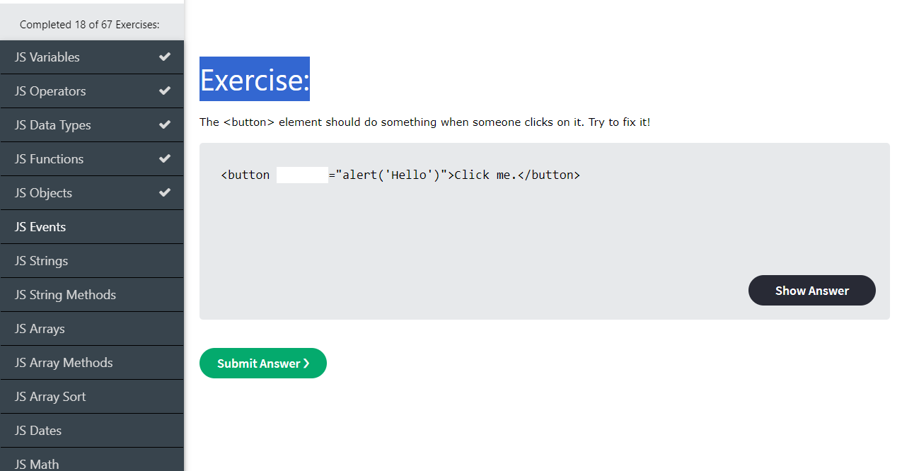

# code-daily

Track personal code practice.
 
### After long Break - Day - 1 - Keep Consistency

- Variables and data types
### Day - 2 - Skipped

- Due to personal reason
### Day - 3 - Short coding

- Expressions and operators
### Day - 4 - Operators

- Assigning to properties
- Destructuring 
- Evaluation and nesting 
- Comparison operators

### Day - 5 - Missed
### Day - 6 - Expressions

- Arithmetic operators
- Bitwise operators 
- Logical operators 
### Day - 7 - Expressions

- BigInt operators
- String operators
- Conditional (ternary) operator
- Comma operator
- Unary operators

### Day - 8 - Expressions completed

- typeof
- Relational operators
- built-in objects
- Custom objects
- instanceof
- this
- Grouping operator
- new
- super
- Practiced - JavaScript Tricks

[Medium](https://javascript.plainenglish.io/some-simple-and-amazing-javascript-tricks-292e1962b1f6)
### Day - 9 - Exercised from w3schools

- JS Variables 
- JS Operators 
- JS Data Types 
- JS Functions 
- JS Objects 

